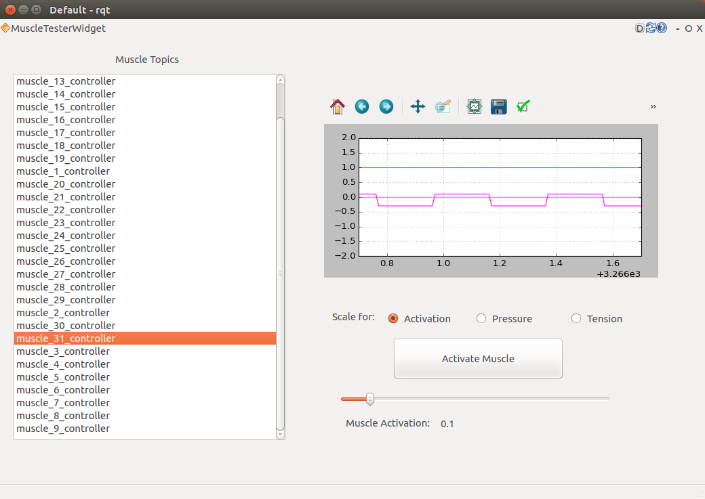

# Muscle Tester rqt Plugin

## Introduction
This rqt plugin provides the functionality of testing Pneumatic Artificial Muscles driven by the [MuscleController](https://github.com/arne48/arl_controllers).

## Screenshot


## Usage
This plugin can be started by the following command
```bash
rosrun arl_muscle_tester rqt_arl_muscle_tester
``` 
or once discovered it can be found in the _Robot Tools_ category of rqt.

__Behind the GUI__
This plugin allows to easily select a muscle and excite it with a given activation value.
The activation message will be sent upon the the _Activate Muscle_ button is being pressed. 
Once the button is released an activation message is sent to blow-off the air.

__Using the GUI__
The "_Scale for_" radio buttons do set an appropriate (according to the controllers ranges of values) limit to the plot's y-axis.
Klicking the _Activate Muscle_ Button in a fast manner might lead to missed presses.
